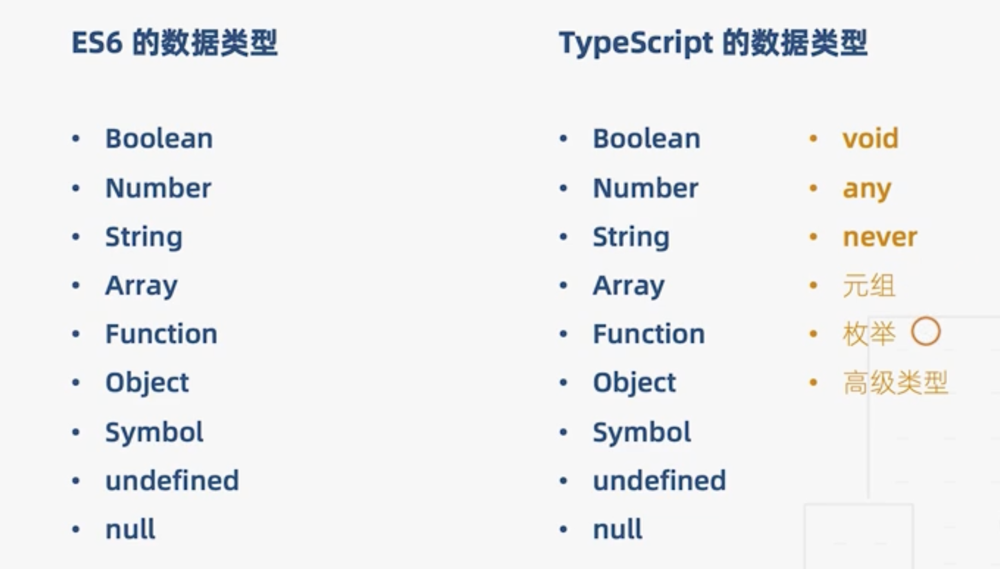

# Typescript 的基本类型

<div align=center></div>

## 类型注解

> 作用：相当于强类型语言中的类型声明

语法：<font color=red>（变量/函数）:type</font>

## 基本类型

```typescript
// 原始类型
let str: string = "gdd";
let num: number = 123;
let bol: boolean = false;

// 数组：
let arr1: number[] = [1, 2, 3];
let arr2: Array<number> = [1, 2, 3]; // 这里的Array是ts给定义的泛型接口
let arr3: Array<number | string> = [1, 2, 3, "4"]; // |表示联合类型，数组元素既可以是number类型，也可以是string类型

// 元祖（限定了数组元素的类型和个数）
let tuple: [number, string] = [0, "1"];
// 元祖越界，可以通过push方法添加一个新数组元素，但这个数组元素不能被访问。尽量避免元祖越界

// 函数 (在括号后面加函数返回值类型，这个可以省略，因为ts具有类型推断功能)
let add = (x: number, y: number): number => x + y;
// 定义一个函数类型：
let compute: (x: number, y: number) => number;
compute = (a, b) => a + b;

// 对象
let obj: object = { x: 1, y: 2 };
// obj.x=4// 这种操作在ts中不允许
// 下面这种定义可以：
let obj2: { x: number; y: number } = { x: 1, y: 2 };
obj2.x = 4;

// Symbol类型
let s1: symbol = Symbol();
let s2 = Symbol();

// undefined,null
let un: undefined = undefined; // 这时候un就不能被赋值为其他类型了
let nu: null = null;
// 设置tsconfig.json中的 "strictNullChecks": false，就可以把undefined，null变为其他类型的子类型，看下方例子：
let num3: number = 3;
num3 = undefined; // 因为undefined是number的子类，所以可以把num3设置为undefined

// void类型（在js中void让任何表达式返回undefined，在ts中void表示没有任何返回值的类型）
let noReturn = () => {}; // let noReturn: () => void

// any类型，可以任意赋值，就跟js没区别了，但不建议使用

// never类型，表示永远不会有返回值的类型
let error = () => {
  throw new Error("错误了");
}; // let error: () => never
```
